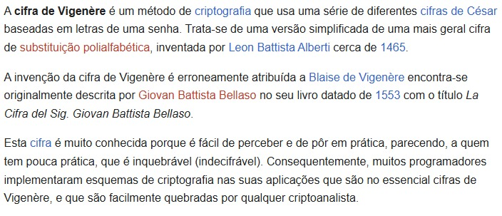

  <h1>Cifra de Vigenère</h1>  

  

 

  <h2>Detalhes:</h2>

  <strong>Status</strong>: Finalizado  
  <strong>Tempo em desenvolvimento</strong>: 1 dia.   

  <h2>O que foi utilizado no projeto:</h2>

<ul>
  <li>Javascript</li>
</ul>

  <h2>O que o sistema faz:</h2>

<ul>
  <li>Recebe uma mensagem, trata e cifra.</li>
</ul>

  <h2>Melhorias:</h2>

<ul>
  <li>Ter a opção de decodificar a mensagem inserindo ela e a chave</li>
  <li>Talvez fazer uma UI com HTML contendo um formulário para enviar a mensagem e receber ela cifrada.</li>
</ul>

  <h2>O que aprendi com este projeto:</h2>

<ul>
  <li>Aprimorei a lógica de programação com Javascript</li>
  <li>Aprimorei a abstração</li>
</ul>

  <h2>Output</h2>  

  

